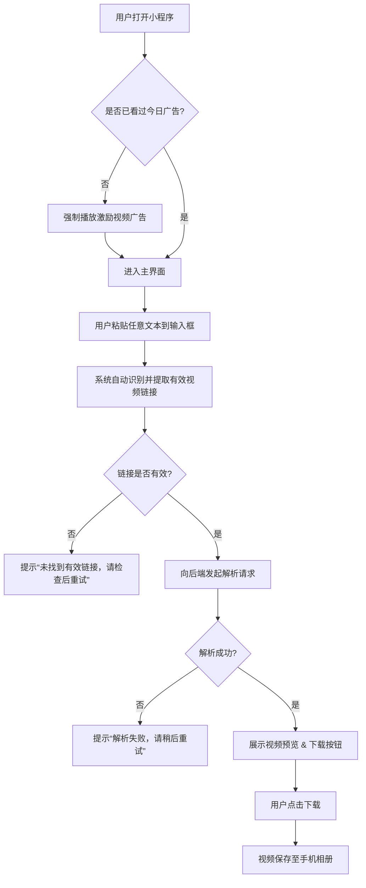

# 短视频智能优化助手 - 产品需求文档 (PRD) V2

## 1. 文档概述
### 1.1 产品名称
短视频智能优化助手

### 1.2 文档目的
本文档旨在明确产品的核心功能、目标用户、使用流程及关键业务规则，为后续的技术开发、测试和运营提供统一的基准。**V2版本根据技术评审结果，对功能描述和合规性进行了重要调整。**

### 1.3 目标平台
微信小程序

## 2. 产品定位与市场分析
### 2.1 产品定位
一款专注于为用户提供便捷、高效、免费（带广告）的主流短视频平台（抖音、快手等）**视频内容优化与下载服务**的工具型小程序。

### 2.2 目标用户
- **内容创作者**：需要素材进行二次创作或参考。
- **普通用户**：希望保存喜欢的视频到本地，并获得更好的观看体验。
- **社交媒体运营者**：收集竞品或热点视频素材。

### 2.3 市场现状
目前市场上存在大量类似工具，但普遍存在以下问题：
- **稳定性差**：随着平台反爬策略升级，很多工具很快失效。
- **体验不佳**：步骤繁琐，需要多次跳转或手动操作。
- **安全性存疑**：部分工具夹带恶意软件或过度收集用户信息。
- **变现模式单一**：要么完全免费无收入，要么付费墙过高。

我们的机会点在于：通过稳定的解析能力、极致的用户体验（一键粘贴即得）和合理的广告激励模式，在竞争中脱颖而出。

## 3. 核心功能需求
### 3.1 功能清单与优先级 (MoSCoW)
| 功能 | 描述 | 优先级 |
| :--- | :--- | :--- |
| **Must Have** | | |
| 视频链接自动识别与粘贴 | 用户粘贴任意文本，系统自动识别并提取其中的抖音/快手分享链接。 | Must |
| 视频智能优化与下载 | 成功解析主流平台（首期：抖音、快手）的分享链接，获取可下载的视频源地址，并提供基础画质增强选项。 | Must |
| 视频预览与下载 | 在小程序内提供视频预览，并支持一键下载到手机相册。 | Must |
| 微信小程序激励视频广告 | 接入微信官方激励视频广告组件。 | Must |
| **Should Have** | | |
| 广告激励逻辑 | 用户每日首次使用需观看一次激励广告，之后当日可无限次使用。 | Should |
| 多平台支持扩展性 | 架构设计上易于未来接入更多短视频平台（如小红书、B站等）。 | Should |
| **Could Have** | | |
| 历史记录 | 记录用户最近解析过的视频链接，方便再次访问。 | Could |
| 分享功能 | 将优化后的视频直接分享给好友。 | Could |
| **Won't Have (V1)** | | |
| 用户账户体系 | V1版本不包含登录注册功能。 | Won't |
| 付费去广告 | V1版本仅提供广告激励模式。 | Won't |
| 高清无水印承诺 | V1版本不承诺提供特定画质或完全去除水印。 | Won't |

## 4. 用户使用流程 (User Flow)

## 5. 关键业务规则
### 5.1 广告激励规则
- **触发条件**：用户在当日（00:00 - 23:59）首次尝试解析视频时。
- **验证方式**：通过微信小程序的本地缓存（`wx.setStorageSync`）记录用户最后观看广告的时间戳。
- **豁免情况**：广告播放失败（如网络错误、用户中途关闭）不应视为已观看，下次仍需观看。

### 5.2 链接解析规则
- **输入**：接受任何形式的文本输入，包括但不限于：
  - 抖音/快手App内复制的完整分享文案（含文字、链接、话题等）。
  - 纯粹的视频短链接（如 `v.douyin.com/xxxxx`）。
- **输出**：提供可直接用于播放和下载的 `.mp4` 文件直链。**不承诺移除原始水印或提供最高画质。**

### 5.3 合规声明
- **使用范围**：本工具仅供个人学习、研究或欣赏使用，不得用于任何商业目的。
- **免责声明**：用户应确保其下载行为符合原视频平台的用户协议及相关法律法规。因不当使用本工具产生的任何法律后果，由用户自行承担。

## 6. 非功能性需求
- **性能**：从用户点击“解析”到视频预览出现，平均耗时应小于3秒。
- **稳定性**：核心解析功能的可用性目标为95%（考虑到平台策略变动因素）。
- **合规性**：严格遵守微信小程序平台规范，不诱导分享，不收集非必要用户信息。

## 7. 待确定事项 (Open Questions)
- 抖音、快手等平台的反爬策略具体强度如何？技术实现的长期维护成本？
- 微信小程序对于此类“下载”功能是否有特殊限制或审核风险？

---
**文档版本**: 2.0
**最后更新**: 2024-06-15
**修订说明**: 根据架构师技术评审报告，将产品定位从“去水印”调整为“智能优化”，弱化高清无水印承诺，增加合规声明。
**作者**: 产品经理