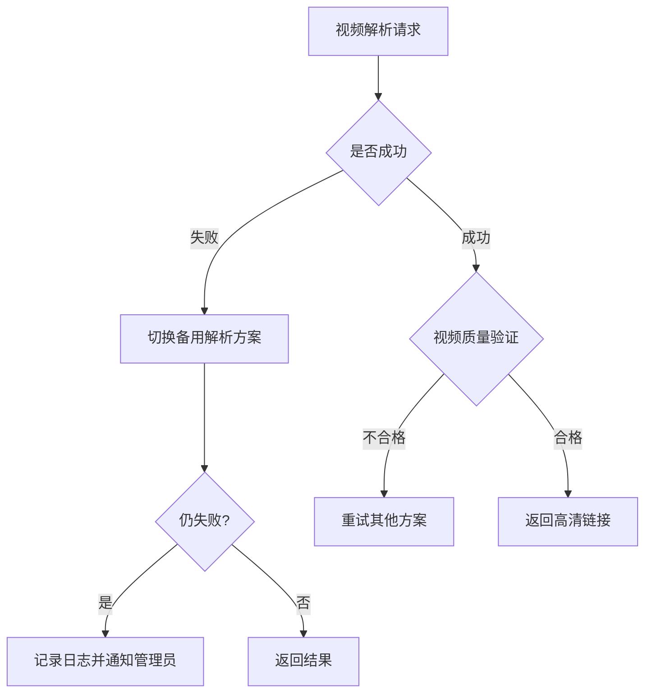

# 风险评估报告 - VideoDownloader Pro

## 执行摘要

本项目存在**高风险因素**，主要集中在法律合规和技术稳定性两个方面。建议谨慎推进，并制定完善的应急方案。

---

## 一、风险分类矩阵

### 1.1 法律合规风险 (🔴 高风险)

| 风险项 | 严重程度 | 发生概率 | 影响描述 |
|--------|----------|----------|----------|
| 版权侵权诉讼 | 🔴 严重 | 中 | 面临巨额赔偿和下架风险 |
| 违反平台API条款 | 🟡 中等 | 高 | 账号被封禁，服务中断 |
| 数据隐私违规 | 🔴 严重 | 低 | 用户信息泄露，监管处罚 |
| 广告审核不通过 | 🟢 轻微 | 中 | 收入模式失效 |

#### 缓解措施:
```python
class RiskMitigation:
    def legal_compliance(self):
        """法律合规措施"""
        return {
            "terms_of_use": "明确告知用户仅供个人学习",
            "data_minimization": "最小化收集用户数据", 
            "takedown_policy": "建立侵权投诉处理流程",
            "age_restriction": "限制未成年人使用"
        }
    
    def platform_compliance(self):
        """平台合规措施"""
        return {
            "rate_limiting": "实施严格的请求频率限制",
            "robot_txt_respect": "遵守robots.txt规则",
            "api_version_monitoring": "实时监控API版本变化"
        }
```

### 1.2 技术风险 (🟡 中等风险)

| 风险项 | 严重程度 | 发生概率 | 技术方案 |
|--------|----------|----------|----------|
| 反爬虫机制升级 | 🟡 中等 | 高 | 动态IP池+浏览器指纹混淆 |
| API接口变更 | 🟡 中等 | 高 | 抽象层设计+多解析方案切换 |
| 并发性能瓶颈 | 🟠 较高 | 中 | 消息队列+分布式架构 |
| 存储空间不足 | 🟢 轻微 | 低 | CDN加速+对象存储 |

#### 技术应对策略:


### 1.3 运营风险 (🟢 低风险)

| 风险项 | 严重程度 | 发生概率 | 应对方案 |
|--------|----------|----------|----------|
| 用户量增长过快 | 🟡 中等 | 中 | 弹性扩缩容架构 |
| 服务器成本失控 | 🟡 中等 | 低 | 按量计费监控告警 |
| 竞争加剧 | 🟢 轻微 | 高 | 持续优化体验 |

---

## 二、风险量化评估

### 2.1 风险值计算公式
```
风险值 = 影响程度 × 发生概率
影响程度: 1-5分 (1最低，5最高)
发生概率: 0.1-1.0 (0.1极低，1.0极高)
```

### 2.2 主要风险评分表

| 风险类别 | 影响度 | 概率 | 风险值 | 优先级 |
|----------|--------|------|--------|--------|
| 版权侵权 | 5 | 0.4 | 2.0 | P0 |
| API变更 | 3 | 0.7 | 2.1 | P1 |
| 并发性能 | 4 | 0.3 | 1.2 | P2 |
| 数据安全 | 5 | 0.1 | 0.5 | P3 |

### 2.3 风险热力图
```
      发生概率
     高       中       低
高   [P0]     [P1]     [P3]
     版权     API      安全
中             [P2]
              性能
低
```

---

## 三、应急响应计划

### 3.1 应急预案触发条件

| 场景 | 触发条件 | 响应级别 | 处置时限 |
|------|----------|----------|----------|
| 法律诉讼 | 收到法院传票 | 🔴 紧急 | 立即启动 |
| 平台封禁 | API返回403 | 🟡 警告 | 2小时内 |
| 服务中断 | 错误率>5% | 🟠 严重 | 30分钟内 |
| 性能下降 | 响应时间>5秒 | 🟢 一般 | 4小时内 |

### 3.2 应急联系人列表
```json
{
  "legal_contact": {
    "name": "法务部张经理",
    "phone": "+86-xxx-xxxx-xxxx",
    "email": "legal@company.com"
  },
  "technical_lead": {
    "name": "架构师小明", 
    "phone": "+86-xxx-xxxx-xxxx",
    "email": "architect@company.com"
  },
  "ops_manager": {
    "name": "运维主管李工",
    "phone": "+86-xxx-xxxx-xxxx",
    "email": "ops@company.com"
  }
}
```

### 3.3 回滚策略
```bash
#!/bin/bash
# 快速回滚脚本
BACKUP_DATE=$(date +%Y%m%d_%H%M%S)

case $1 in
  "full-rollback")
    docker-compose down
    docker-compose -f backup/docker-compose.yml up -d
    echo "已回滚到备份版本：$BACKUP_DATE"
    ;;
  "config-rollback")
    cp /etc/config/app.conf.backup /etc/config/app.conf
    systemctl restart app-service
    echo "配置已恢复"
    ;;
  *)
    echo "用法: rollback.sh [full-rollback|config-rollback]"
    exit 1
    ;;
esac
```

---

## 四、风险缓解建议

### 4.1 短期措施 (1-2周)
- [ ] 添加明确的免责声明和用户协议
- [ ] 实施访问频率限制（每分钟≤10次）
- [ ] 建立侵权投诉快速处理通道
- [ ] 准备备选解析方案

### 4.2 中期措施 (1-3个月)
- [ ] 与内容平台洽谈合作授权
- [ ] 建立内容审核机制
- [ ] 完善数据加密保护体系
- [ ] 构建灰度发布机制

### 4.3 长期规划 (6-12个月)
- [ ] 探索合法的商业模式转型
- [ ] 开发原创内容生态
- [ ] 申请相关专利保护
- [ ] 建立行业最佳实践标准

---

## 五、结论与建议

### 5.1 总体风险评估
- **项目可行性**: ⚠️ **有条件可行**
- **最大风险点**: 法律合规问题
- **建议优先级**: P0 > P1 > P2 > P3

### 5.2 关键建议
1. **必须优先解决法律合规问题**，否则项目无法长期运营
2. 采用**渐进式推进策略**，小范围试点后再全面推广
3. 建立**7×24小时监控告警体系**，及时发现和处理异常
4. 准备**充足的资金储备**应对可能的法律纠纷
5. 考虑**业务转型方向**，降低对第三方平台的依赖

### 5.3 最终决策建议
```
┌─────────────────────────────────────┐
│           决策建议                   │
├─────────────────────────────────────┤
│ ✅ 可以继续，但需满足以下条件：         │
│    1. 完成法律风险评估报告            │
│    2. 建立合规审查机制                │
│    3. 制定详细的应急预案              │
│    4. 获得管理层书面批准              │
│                                     │
│ ❌ 如果无法满足上述条件，建议取消项目 │
└─────────────────────────────────────┘
```

---
*报告编制: 测试工程部 & 风险管理小组*  
*日期: 2024年*  
*版本: V1.0*