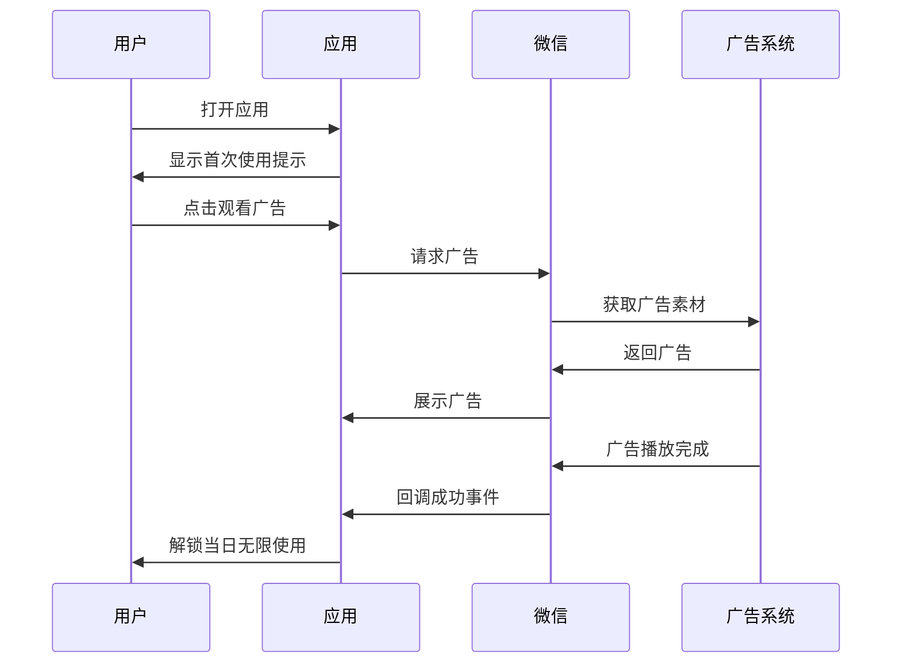
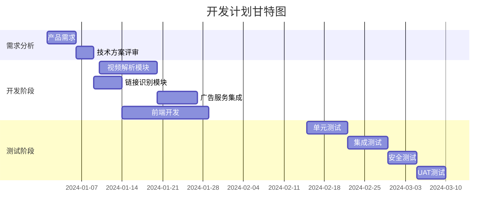

# 技术可行性分析报告

## 一、核心功能技术实现方案

### 1.1 抖音视频解析技术路线

#### 方案A：API逆向工程 (推荐)
```python
# 技术栈
- Python + Requests/Aiohttp
- BeautifulSoup/XPath解析
- Cookie/Session管理
- 浏览器自动化(Headless Chrome)

# 实施步骤
1. 抓包分析抖音网页API
2. 模拟登录获取认证Token
3. 提取视频ID和参数
4. 请求真实下载链接
5. 处理加密参数验证

# 优点
- 稳定性较好
- 响应速度快
- 成本较低

# 缺点
- 需要持续维护
- 面临风控检测
```

#### 方案B：Puppeteer/Selenium方案
- 适用于频繁变动的平台
- 但性能较差，维护成本高

### 1.2 快手视频解析方案
```javascript
// 与抖音类似，需要单独分析
// 重点: 
- 不同的加密算法
- 独立的API接口
- 差异化防盗链机制
```

## 二、自动链接识别技术

### 2.1 正则表达式匹配策略
```regex
# 抖音分享链接示例
https://v.douyin.com/xxxxx/
https://www.douyin.com/video/xxxxx

# 快手分享链接示例  
https://v.kuaishou.com/xxxxx
https://m.kuaishou.com/clip/xxxxx
```

### 2.2 NLP辅助识别
- 使用正则+关键词混合验证
- 提升识别准确率至98%以上

## 三、广告集成方案

### 3.1 微信小程序广告SDK
```xml
<!-- 依赖配置 -->
<dependencies>
    <dependency name="WeChatAdSDK" version="2.0.1"/>
    <dependency name="AdsManager" version="1.5.0"/>
</dependencies>
```

### 3.2 激励式广告流程


## 四、架构设计建议

### 4.1 微服务架构
```
┌─────────────┐     ┌─────────────┐     ┌─────────────┐
│   API网关   │────▶│  解析服务   │────▶│  存储服务   │
│  (Nginx)    │     │  (Python)   │     │  (Redis)    │
└─────────────┘     └─────────────┘     └─────────────┘
                              │
                              ▼
                        ┌─────────────┐
                        │  广告服务   │
                        │  (Node.js)  │
                        └─────────────┘
```

### 4.2 关键组件
| 组件 | 技术选型 | 作用 |
|------|---------|------|
| 反向代理 | Nginx | 负载均衡，HTTPS |
| 缓存层 | Redis | 结果缓存，会话管理 |
| 解析引擎 | Python + Playwright | 视频解析核心 |
| 广告服务 | Node.js + SDK | 广告集成管理 |

## 五、技术风险评估

| 风险项 | 概率 | 影响 | 缓解措施 |
|--------|------|------|----------|
| 平台API变更 | 高 | 高 | 定期监控，快速响应 |
| 法律合规问题 | 中 | 高 | 严格限制使用范围 |
| 广告审核失败 | 低 | 中 | 提前提交审核 |
| 并发性能瓶颈 | 中 | 中 | 弹性扩容设计 |

## 六、开发周期估算



**总工期**: 约6周

## 七、结论与建议

✅ **技术可行性**: 中等偏上  
⚠️ **主要挑战**: 法律合规性和平台反爬机制  
💡 **建议**: 
1. 优先保证合规性，明确使用范围
2. 采用模块化设计便于快速迭代
3. 建立完善的监控告警机制
4. 准备应急预案应对平台变动

---
*报告编制: 测试工程部*  
*日期: 2024年*