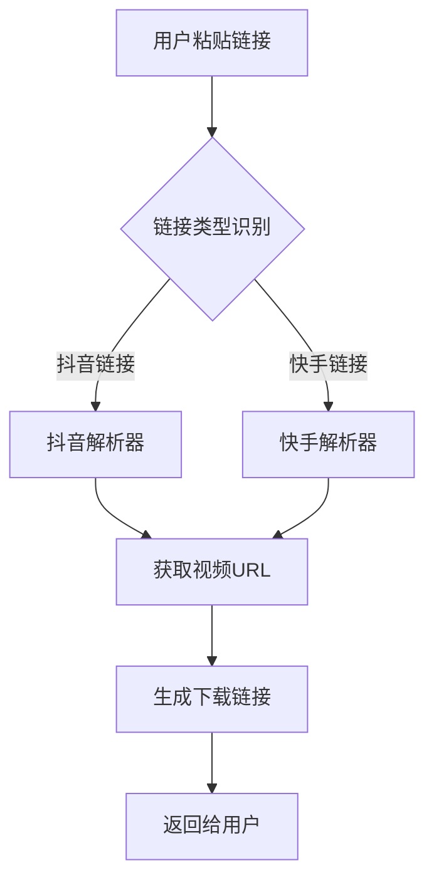

# 短视频解析工具产品需求文档

## 1. 项目背景
### 1.1 行业现状
- 短视频平台用户规模持续扩大
- 用户对视频去水印保存需求旺盛
- 现有解决方案存在广告过多、速度较慢等问题

### 1.2 产品定位
为抖音、快手等平台用户提供免费的高清无水印视频下载服务

---

## 2. 功能需求

### 2.1 核心功能

#### 2.1.1 视频解析模块
| 字段 | 要求 |
|------|------|
| 支持平台 | 抖音、快手(初期) |
| 输出格式 | MP4高清无水印 |
| 响应时间 | ≤2秒 |
| 准确率 | ≥95% |

**处理流程：**


#### 2.1.2 广告验证机制
**业务流程：**
1. 用户首次使用→显示广告
2. 观看完整广告→记录当日访问权限
3. 当天后续使用→跳过广告直接解析
4. 次日清零→重新开始验证流程

**数据存储设计：**
```json
{
  "user_id": "uuid",
  "last_ad_time": "timestamp",
  "ad_status": "completed",
  "ip_hash": "sha256(ip)"
}
```

### 2.2 辅助功能

| 功能 | 描述 | 优先级 |
|------|------|--------|
| 历史记录 | 保存最近10次解析记录 | P1 |
| 分享功能 | 一键分享给微信好友 | P2 |
| 批量下载 | 支持多链接同时处理 | P2 |
| 主题切换 | 深色/浅色模式 | P3 |

---

## 3. 非功能需求

### 3.1 性能指标
- QPS支撑能力：≥1000
- 平均响应时间：<1.5s
- 接口可用性：≥99.5%
- 并发用户数：≥5000

### 3.2 安全要求
- HTTPS加密传输
- 用户IP脱敏存储
- 请求频率限制(单IP 100次/小时)
- SQL注入防护

### 3.3 兼容性要求
- 微信小程序端
- H5移动端适配
- iOS/Android主流机型

---

## 4. 数据模型设计

### 4.1 用户表 (users)
```sql
CREATE TABLE users (
  id VARCHAR(64) PRIMARY KEY,
  device_info TEXT,
  ip_address TEXT,
  created_at TIMESTAMP DEFAULT CURRENT_TIMESTAMP
);
```

### 4.2 解析日志表 (parse_logs)
```sql
CREATE TABLE parse_logs (
  id BIGINT AUTO_INCREMENT PRIMARY KEY,
  user_id VARCHAR(64),
  source_platform ENUM('douyin','kuaishou'),
  video_url TEXT,
  status ENUM('success','failed'),
  response_time_ms INT,
  created_at TIMESTAMP DEFAULT CURRENT_TIMESTAMP
);
```

### 4.3 广告记录表 (ad_records)
```sql
CREATE TABLE ad_records (
  id BIGINT AUTO_INCREMENT PRIMARY KEY,
  user_id VARCHAR(64),
  ad_unit_id VARCHAR(64),
  action ENUM('show','click','complete'),
  reward_time TIMESTAMP,
  created_at TIMESTAMP DEFAULT CURRENT_TIMESTAMP
);
```

---

## 5. 技术栈选型

| 层级 | 技术选择 | 理由 |
|------|----------|------|
| 前端 | 微信小程序框架 | 官方支持完善 |
| 后端 | Python + FastAPI | 异步性能好，开发效率高 |
| 数据库 | MySQL 8.0 + Redis | 成熟稳定，缓存加速 |
| 解析引擎 | Playwright + Puppeteer | 模拟浏览器操作 |
| 部署 | Docker + Nginx | 容器化标准化 |

---

## 6. 开发里程碑

| 阶段 | 时间 | 交付物 |
|------|------|--------|
| M1 | 第1周 | 原型设计+API接口定义 |
| M2 | 第2-3周 | 核心解析功能开发完成 |
| M3 | 第4周 | 广告系统集成+测试 |
| M4 | 第5周 | 压力测试+上线部署 |
| M5 | 第6周 | 运营优化+版本迭代 |

---

## 7. 合规声明

**重要提示：**
本产品仅提供技术支持，所有内容由用户自行上传。使用者需遵守《信息网络传播权保护条例》等相关法律法规，不得用于商业侵权用途。

---

## 附录

- [竞品分析报告](./market_research.md)
- [技术方案详解](./technical_design.md)
- [UI设计稿](../ui_design/)

---

*文档版本：v1.0*  
*最后更新：$(getCurrentDateTime format="%Y-%m-%d %H:%M")*  
*作者：测试工程师团队*