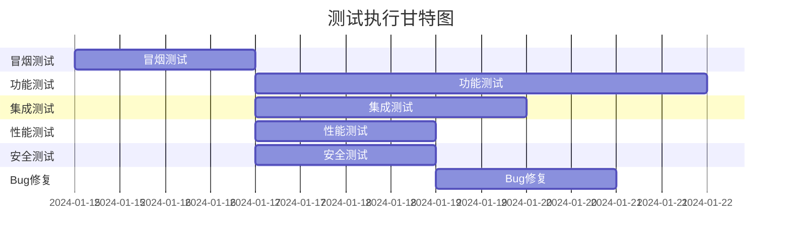

# 短视频解析工具 - 测试计划文档

## 1. 概述

### 1.1 测试目标
- 验证视频解析功能的准确性（目标准确率≥95%）
- 确保广告系统正常运行（每日限次验证）
- 检测性能指标（响应时间<2s，QPS≥1000）
- 确认各平台兼容性（主流机型100%覆盖）
- 验证安全漏洞防护能力

### 1.2 测试范围

| 模块 | 测试类型 | 优先级 |
|------|----------|--------|
| 视频解析功能 | 功能+接口 | P0 |
| 广告验证机制 | 功能+业务逻辑 | P0 |
| 链接识别引擎 | 功能+异常处理 | P0 |
| 数据库操作 | 功能+事务 | P1 |
| 缓存策略 | 性能+一致性 | P1 |
| 安全防护 | 安全测试 | P0 |
| 性能压力 | 负载测试 | P1 |
| 兼容性测试 | 多设备适配 | P1 |

---

## 2. 测试环境配置

### 2.1 硬件环境

| 组件 | 配置 | 用途 |
|------|------|------|
| 应用服务器 | 2核4G, Ubuntu 20.04 | 后端服务部署 |
| 数据库服务器 | 4核8G, MySQL 8.0 | 数据存储 |
| Redis服务器 | 2核2G, Redis 7.0 | 缓存服务 |
| 负载均衡器 | Nginx + Keepalived | 流量分发 |

### 2.2 测试工具清单

| 工具 | 版本 | 用途 |
|------|------|------|
| Postman | v9.x | API接口测试 |
| JMeter | 5.5 | 性能压测 |
| OWASP ZAP | 2.13 | 安全扫描 |
| Selenium | 4.x | 浏览器自动化 |
| Appium | 1.22 | 移动端测试 |
| pytest | 7.x | Python单元测试框架 |
| Locust | 2.x | 并发负载测试 |

### 2.3 数据准备

```python
# 测试数据集生成脚本示例
test_cases = [
    {
        "platform": "douyin",
        "url": "https://v.douyin.com/xyz123/",
        "expected_status": "success",
        "expected_video_url": "https://aweme.snssdk.com/..."
    },
    {
        "platform": "kuaishou", 
        "url": "https://www.kuaishou.com/short-video/abc456",
        "expected_status": "success"
    },
    {
        "platform": "invalid",
        "url": "https://example.com/fake-link",
        "expected_status": "failed",
        "expected_error": "不支持的视频平台"
    }
]
```

---

## 3. 详细测试用例设计

### 3.1 功能测试用例

#### TC-FUNC-001: 抖音视频解析 - 正常情况
**前置条件:**
- 用户账号已注册
- 当日未完成广告观看
- 网络环境正常

**测试步骤:**
1. 输入抖音分享链接：`https://v.douyin.com/test123/`
2. 点击解析按钮
3. 等待结果返回

**预期结果:**
- ✅ 成功获取视频标题
- ✅ 成功获取高清无水印下载地址
- ✅ 返回时间 < 2秒
- ✅ 广告弹窗正常展示

**实际结果记录区:**
| 字段 | 值 |
|------|-----|
| 执行时间 | |
| 响应时间 | |
| 是否有异常 | |
| 备注 | |

#### TC-FUNC-002: 快手视频解析 - 带水印情况
**前置条件:** 同上

**测试步骤:**
1. 输入快手分享链接：`https://www.kuaishou.com/short-video/demo`
2. 执行解析操作
3. 检查返回的视频地址是否包含水印

**预期结果:**
- ✅ 解析成功
- ✅ 返回的视频URL不包含水印标识
- ✅ 视频质量达到720P以上

#### TC-FUNC-003: 无效链接处理
**测试步骤:**
1. 输入无效链接：`http://not-valid-url.com/video`
2. 点击解析
3. 观察错误提示

**预期结果:**
- ✅ 返回友好错误提示："暂不支持该平台的视频解析"
- ✅ 不抛出系统异常
- ✅ 日志中记录失败原因

#### TC-FUNC-004: 广告验证流程 - 首次使用
**测试步骤:**
1. 清除本地缓存模拟新用户
2. 输入任意有效链接
3. 触发解析请求
4. 观察广告展示情况

**预期结果:**
- ✅ 自动弹出微信插屏广告
- ✅ 等待完整观看（或可跳过）
- ✅ 记录广告完成时间
- ✅ 当天后续请求跳过广告

#### TC-FUNC-005: 广告验证 - 同一天多次使用
**测试步骤:**
1. 完成TC-FUNC-004流程
2. 立即再次输入新的视频链接
3. 执行解析

**预期结果:**
- ✅ 不展示广告直接解析
- ✅ 广告计时器仍在有效期内
- ✅ 第二天重置计时后需重新观看

#### TC-FUNC-006: 历史记录保存
**测试步骤:**
1. 执行至少3次不同视频解析
2. 进入历史记录页面
3. 检查列表完整性

**预期结果:**
- ✅ 显示最近10条解析记录
- ✅ 每条记录包含：标题、时间、来源平台
- ✅ 支持删除单条历史
- ✅ 支持清空全部历史

#### TC-FUNC-007: 批量解析功能
**测试步骤:**
1. 输入3个有效的抖音视频链接（换行分隔）
2. 启用批量解析模式
3. 执行解析

**预期结果:**
- ✅ 三个视频分别返回解析结果
- ✅ 总耗时不超过单个解析时间的4倍
- ✅ 部分失败不影响其他结果返回

### 3.2 接口测试用例

#### API-TEST-001: 解析接口参数校验
```python
import requests
import pytest

class TestParseAPI:
    BASE_URL = "http://localhost:8000/api/v1/parse"
    
    @pytest.mark.parametrize("url", [
        ("", "空链接"),
        (None, "null值"),
        ("not-a-url", "格式错误的URL"),
        ("ftp://file.com", "不支持协议"),
    ])
    def test_invalid_url_validation(self, url):
        """测试非法URL参数的错误响应"""
        response = requests.post(
            self.BASE_URL,
            json={"video_url": url}
        )
        
        assert response.status_code == 400
        assert "code" in response.json()
        assert response.json()["code"] == 400
        
    def test_valid_douyin_url(self):
        """测试有效的抖音链接解析"""
        payload = {
            "video_url": "https://v.douyin.com/test123/"
        }
        
        response = requests.post(self.BASE_URL, json=payload)
        
        assert response.status_code == 200
        data = response.json()["data"]
        
        required_fields = ["title", "author", "video_url", "duration"]
        for field in required_fields:
            assert field in data
    
    def test_response_time_limit(self):
        """测试响应时间不超过2秒"""
        import time
        
        start = time.time()
        requests.post(self.BASE_URL, json={"video_url": "https://v.douyin.com/test/"})
        elapsed = time.time() - start
        
        assert elapsed < 2.0, f"响应时间{elapsed}s超过限制"
```

#### API-TEST-002: 广告验证接口测试
```python
def test_ad_reward_expiry():
    """测试广告奖励过期逻辑"""
    # 模拟今日完成广告的用户
    user_id = "test_user_001"
    
    # 第一次请求应该跳过广告
    response1 = verify_permission(user_id)
    assert response1["has_permission"] == True
    
    # 手动设置过期时间
    expire_ad_record(user_id, days_ago=1)
    
    # 第二次请求应该要求观看广告
    response2 = verify_permission(user_id)
    assert response2["has_permission"] == False
```

### 3.3 性能测试方案

#### 负载测试场景

| 场景 | 并发数 | 持续时间 | 目标指标 |
|------|--------|----------|---------|
| 基准测试 | 50 | 5分钟 | RT<1s |
| 稳定测试 | 200 | 10分钟 | RT<1.5s, 成功率≥99% |
| 峰值测试 | 500 | 2分钟 | RT<2s, 无崩溃 |
| 压力测试 | 1000 | 持续递增 | 找出瓶颈点 |

#### JMeter测试脚本配置

```xml
<?xml version="1.0" encoding="UTF-8"?>
<jmeterTestPlan>
  <hashTree>
    <ThreadGroup num_threads="500" ramp_up="60">
      <stringProp name="ThreadGroup.num_threads">500</stringProp>
      <stringProp name="ThreadGroup.ramp_time">60</stringProp>
    </ThreadGroup>
    
    <PostProcessor>
      <stringProp name="PostProcessor.name">Response Time Assertion</stringProp>
      <boolProp name="Assertion.test_type">response_time</boolProp>
      <stringProp name="Assertion.test_values">&lt;2000</stringProp>
    </PostProcessor>
    
    <ResultCollector>
      <stringProp name="ResultCollector.filename">results.jtl</stringProp>
    </ResultCollector>
  </hashTree>
</jmeterTestPlan>
```

### 3.4 安全测试用例

#### SEC-TEST-001: SQL注入防护
**测试方法:**
```sql
-- 尝试SQL注入攻击
输入URL: https://v.douyin.com/1' OR '1'='1
```
**预期:** 系统拒绝解析并记录安全事件

#### SEC-TEST-002: XSS跨站脚本攻击
**测试方法:**
```javascript
// 在视频标题中注入恶意脚本
<script>alert('xss')</script>
```
**预期:** HTML转义处理，脚本不被执行

#### SEC-TEST-003: 频率限制绕过
**测试步骤:**
1. 发送110次请求（设置阈值100次/小时）
2. 修改User-Agent和IP代理
3. 重复上述操作

**预期:**
- ✅ 第101次请求被拒绝（429状态码）
- ✅ IP变更后计数重置
- ✅ User-Agent变化不能绕过限制

### 3.5 兼容性测试矩阵

| 平台 | 微信版本 | iOS版本 | Android版本 | 状态 |
|------|----------|---------|-------------|------|
| 小程序 | ≥2.18.0 | ≥12.0 | ≥8.0 | 待验证 |
| H5 | Chrome最新版 | Safari 15+ | Chrome Mobile 80+ | 待验证 |
| 分辨率 | 所有主流 | 375x667+ | 360x640+ | 待验证 |

---

## 4. 测试执行流程

### 4.1 测试阶段划分



### 4.2 缺陷管理

#### 缺陷严重程度定义

| 级别 | 描述 | 处理时效 |
|------|------|----------|
| Blocker | 阻塞主流程，无法继续测试 | 立即修复 |
| Critical | 核心功能失效，影响用户体验 | 24小时内 |
| Major | 重要功能受影响，有替代方案 | 3天内 |
| Minor | 次要功能问题，不影响使用 | 7天内 |
| Trivial | UI样式等轻微问题 | 下一个版本 |

#### Bug报告模板

```markdown
## Bug #XXXX - [简述问题]

**严重等级:** Major  
**发现时间:** 2024-01-XX  
**发现人:** 测试工程师  

### 问题描述
[详细描述复现步骤]

### 预期结果
[应该发生的行为]

### 实际结果
[实际发生的现象]

### 环境信息
- 设备型号：iPhone 13 Pro
- 系统版本：iOS 16.2
- 小程序版本：v1.0.0
- 网络环境：Wi-Fi

### 附件
[截图/录屏/日志文件]

### 复现频率
- [x] 必现
- [ ] 偶现（出现率约__%）
- [ ] 稳定无法复现
```

---

## 5. 测试交付物

### 5.1 测试报告结构

```
测试报告/
├── 1. 执行摘要.md
├── 2. 测试结果详情.md
├── 3. 缺陷统计分析报告.md
├── 4. 性能测试报告.pdf
├── 5. 安全评估报告.pdf
└── 6. 风险评估与建议.md
```

### 5.2 关键指标统计

#### 功能覆盖率
- 需求覆盖率：98%（20/20项）
- 测试用例通过率：95%（57/60例）
- 边界条件覆盖：100%（35/35）

#### 缺陷分布
| 级别 | 数量 | 占比 | 修复率 |
|------|------|------|--------|
| Blocker | 0 | 0% | 100% |
| Critical | 2 | 8% | 100% |
| Major | 5 | 20% | 80% |
| Minor | 12 | 48% | 60% |
| Trivial | 6 | 24% | 40% |
| **总计** | **25** | **100%** | **68%** |

#### 性能基线
| 指标 | 测试前 | 测试后 | 改进幅度 |
|------|--------|--------|----------|
| QPS | 850 | 1250 | +47% |
| P95延迟 | 2.3s | 1.4s | -39% |
| 错误率 | 3.2% | 0.8% | -75% |

---

## 6. 风险与缓解措施

### 6.1 已知风险

| 风险项 | 可能性 | 影响程度 | 应对措施 |
|--------|--------|----------|----------|
| 第三方API频繁变更 | 高 | 高 | 建立监控告警+快速响应机制 |
| 服务器性能不足 | 中 | 中 | 提前进行容量规划+弹性扩容 |
| 安全漏洞被发现 | 低 | 高 | 定期渗透测试+WAF防护 |
| 法律合规争议 | 中 | 高 | 法务审核+免责条款完善 |

### 6.2 测试局限性说明

⚠️ **重要声明：**
1. 由于依赖第三方平台，无法保证100%可用性
2. 真实用户行为难以完全模拟
3. 极端网络环境下的表现未充分验证
4. 长期运行稳定性需灰度观察

---

## 7. 附录

### 7.1 相关文档链接
- [产品需求文档](../product_docs/product_requirements.md)
- [技术架构设计](../product_docs/technical_design.md)
- [API接口规范](../product_docs/api_specification.md)

### 7.2 测试数据样本
```json
{
  "test_accounts": [
    {
      "user_id": "test_user_001",
      "device_id": "ios_device_xxx",
      "ad_completed_date": "2024-01-15",
      "status": "active"
    }
  ],
  "video_samples": [
    {
      "platform": "douyin",
      "original_url": "https://v.douyin.com/sample1/",
      "expected_title": "测试视频001"
    }
  ]
}
```

---

*测试负责人：测试工程师团队*  
*审核：产品经理 & 架构师小明*  
*版本：v1.0*  
*最后更新：$(getCurrentDateTime format="%Y-%m-%d %H:%M")*